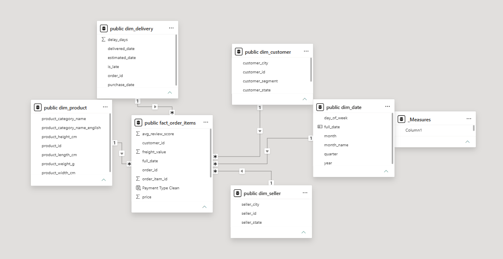
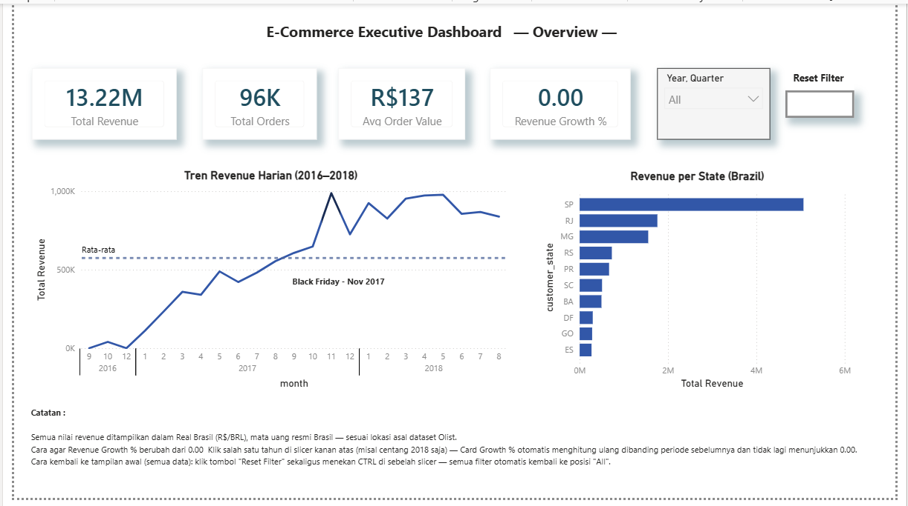
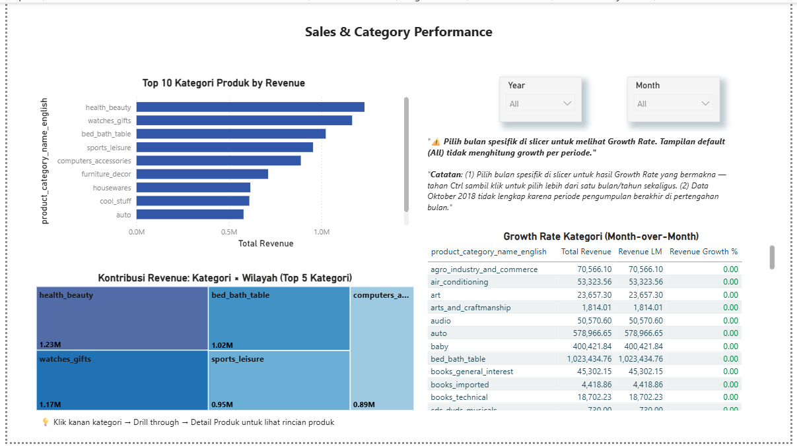
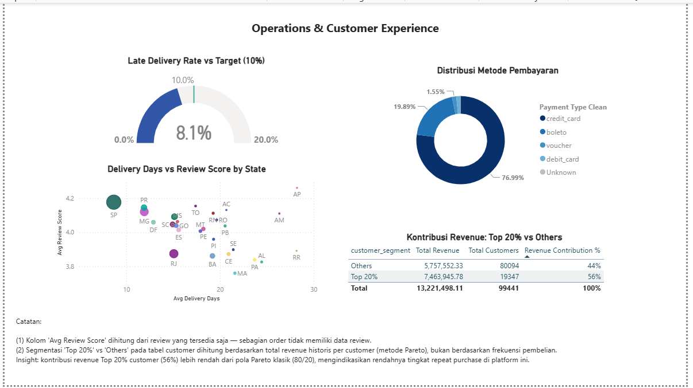

# Olist E-Commerce Executive BI Dashboard

Dashboard Power BI end-to-end untuk memantau performa e-commerce Olist (Brazil) secara berkelanjutan — dibangun sebagai sistem pelaporan otomatis (bukan analisis sekali jalan), dengan pendekatan berbasis kebutuhan 3 stakeholder utama.

**[▶️ Tonton Video Demo (2-3 menit)](LINK_VIDEO_YOUTUBE_DI_SINI)**

---

## 1. Latar Belakang & Perbedaan dengan Project Data Analyst

Project ini menggunakan dataset yang sama dengan [project Data Analyst](https://github.com/GalFoks/ecommerce-sales-performance-analysis) sebelumnya secara sengaja, sebagai studi kasus untuk mendemonstrasikan dua pendekatan analitis yang berbeda terhadap **satu masalah bisnis yang sama**:

| Aspek | Project Data Analyst | Project BI (ini) |
|---|---|---|
| Sifat | Analisis mendalam, sekali jalan | Dashboard live, dipakai berkala |
| Tools | SQL + Python + statistical test | PostgreSQL + Power BI + DAX |
| Output | Laporan + rekomendasi | Dashboard interaktif self-service |
| Fokus | "Kenapa" (diagnostic) | "Apa yang terjadi sekarang" (monitoring) |

## 2. Dataset

[Olist Brazilian E-Commerce Dataset](https://www.kaggle.com/datasets/olistbr/brazilian-ecommerce) — 9 tabel mentah (customers, orders, order_items, payments, reviews, products, sellers, geolocation, category translation), diimpor ke PostgreSQL.

## 3. Stakeholder Requirements

Sebelum membangun dashboard, requirement disimulasikan dari 3 kebutuhan berbeda:

- **CEO (Executive View):** angka besar dalam 5 detik — revenue, growth, top region
- **Sales/Marketing Manager:** breakdown performa per kategori & wilayah, filter per periode, untuk strategi promosi
- **Operations Manager:** delivery performance dan customer satisfaction, untuk identifikasi masalah logistik

## 4. Arsitektur & Data Model

### Tech Stack
`PostgreSQL` (data modeling via SQL Views) → `Power BI Desktop` (Import mode) → `DAX` (business logic)

### Star Schema



**1 Fact Table:** `fact_order_items` (grain: 1 baris = 1 item order, hanya order berstatus `delivered`)
**5 Dimension Tables:** `dim_date`, `dim_customer`, `dim_product`, `dim_seller`, `dim_delivery`

**Keputusan desain penting:**
- `dim_date` dibangun pakai `generate_series` agar kalender **tanpa celah tanggal** — wajib untuk fungsi time intelligence (`DATEADD`) berfungsi benar sebagai Date Table resmi
- Payment dan review diagregasi lewat subquery **sebelum** di-JOIN ke `fact_order_items` (per `order_id`), untuk menghindari fan-out — 1 order yang dibayar dengan >1 metode/cicilan tidak menggandakan baris item
- Kolom `primary_payment_type` diambil dari `payment_sequential = 1` (metode pembayaran pertama), bukan agregasi, karena kolom kategori teks tidak bisa di-SUM/AVG
- Customer segmentation (`Top 20%` vs `Others`) dihitung di **SQL** (`PERCENTILE_CONT`), bukan DAX — menghindari isu performa DAX pada iterasi kuadratik (`PERCENTILEX.INC`) di dataset besar

File SQL lengkap: [`sql/01_create_tables.sql`](sql/01_create_tables.sql), [`sql/02_star_schema.sql`](sql/02_star_schema.sql)

## 5. DAX Measures Kunci

Dari total measure yang dibangun, berikut 5 yang paling menunjukkan pemahaman konsep inti BI:

**Revenue Growth % (Time Intelligence)**
```dax
Revenue LM = CALCULATE([Total Revenue], DATEADD(dim_date[full_date], -1, MONTH))
Revenue Growth % = DIVIDE([Total Revenue] - [Revenue LM], [Revenue LM])
```
Menunjukkan pemahaman `CALCULATE` + `DATEADD` untuk perbandingan periode — measure ini butuh konteks filter bulan spesifik untuk bermakna (di "All", hasilnya 0%).

**Category Rank (Ranking Dinamis)**
```dax
Category Rank = RANKX(ALL(dim_product[product_category_name_english]), [Total Revenue])
```
`ALL()` memastikan ranking dihitung terhadap seluruh kategori, tidak terpengaruh filter kategori aktif di visual yang sama.

**Late Delivery Rate**
```dax
Late Delivery Rate = DIVIDE(CALCULATE([Total Orders], dim_delivery[delay_days] > 0), [Total Orders])
```

**Top State by Category (Dynamic Top-N via SUMMARIZE + TOPN)**
```dax
Top State by Category =
VAR StateRevenueTable =
    SUMMARIZE(
        'public fact_order_items',
        'public dim_customer'[customer_state],
        "StateRevenue", [Total Revenue]
    )
VAR TopState = TOPN(1, StateRevenueTable, [StateRevenue], DESC)
RETURN MAXX(TopState, 'public dim_customer'[customer_state])
```
Dipakai sebagai custom tooltip di treemap — menghitung wilayah dominan secara dinamis sesuai kategori yang sedang di-hover.

**Revenue Contribution % (Context Override)**
```dax
Revenue Contribution % =
DIVIDE([Total Revenue], CALCULATE([Total Revenue], ALL(dim_customer[customer_segment])))
```
`ALL()` di sini menghapus filter segmen supaya pembagi selalu total keseluruhan, bukan sesama baris.

## 6. Struktur Dashboard (3 Halaman)

### Halaman 1 — Executive Summary


Cards KPI (Revenue, Orders, AOV, Growth %), line chart tren bulanan, bar chart revenue per state (pengganti Map visual karena keterbatasan akses Azure Maps di akun organisasi), slicer periode (Year-Quarter hierarchy), tombol **Reset Filter**.

### Halaman 2 — Sales & Category Performance


Bar chart Top 10 kategori by revenue, table growth rate MoM dengan conditional formatting (merah/hijau), treemap kontribusi kategori (info wilayah lewat custom tooltip, bukan nested 2-level — menjaga tampilan tetap bersih), slicer Year/Month independen dari halaman lain.

**Fitur drill-through:** klik kanan kategori manapun di bar chart → *Drill through → Detail Produk* untuk melihat rincian produk dalam kategori tersebut.

### Halaman 3 — Operations & Customer Experience


Gauge Late Delivery Rate vs target 10%, scatter plot delivery days vs review score per state, donut chart distribusi metode pembayaran, table segmentasi customer (Top 20% vs Others).

## 7. Fitur Interaktivitas & Self-Service

- **Drill-through page:** kategori → detail produk ([screenshot](docs/04_detail_produk.png)), halaman di-hide dari navigasi utama agar tidak diakses langsung dalam kondisi filter "nyangkut" — hanya bisa diakses lewat drill-through yang selalu reset filter otomatis
- **Bookmark "Reset Filter":** mengembalikan semua slicer ke kondisi default dalam 1 klik
- **Custom tooltip page:** mini line chart tren revenue bulanan muncul saat hover ke bar chart kategori
- **Row-Level Security (RLS):** role `SP Only` membatasi data ke `customer_state = 'SP'`, diverifikasi lewat *View as Roles* di Power BI Desktop. Enforcement penuh (login per user) membutuhkan Power BI Service dengan akun organisasi — di luar scope portofolio publik ini, sehingga fungsinya didemonstrasikan lewat video demo, bukan link publik langsung.

## 8. Key Insights

- **Kategori top revenue** didominasi `health_beauty`, `watches_gifts`, dan `bed_bath_table` — dan hampir semua top 5 kategori sama-sama paling laku di negara bagian **São Paulo (SP)**, mengindikasikan pasar SP sudah jenuh; strategi promosi ke depan berpotensi lebih efektif menyasar wilayah non-SP yang belum tergarap maksimal.
- **Kontribusi revenue Top 20% customer hanya 56%** dari total — lebih rendah dari pola Pareto klasik (80/20) yang umum di banyak bisnis retail. Ini mengindikasikan **rendahnya tingkat repeat purchase** di platform Olist (mayoritas customer membeli hanya 1 kali), bukan konsentrasi revenue di segelintir loyalis. Implikasinya: strategi bisnis sebaiknya menyeimbangkan akuisisi customer baru dengan program retensi.
- **Data bulan terakhir (Oktober 2018) tidak lengkap** karena periode pengumpulan data berakhir di pertengahan bulan — metrik growth MoM untuk bulan tersebut tidak merepresentasikan tren bisnis asli dan perlu diinterpretasikan dengan hati-hati.
- **Late Delivery Rate aktual 8,1%**, sudah berada di bawah target internal 10% — performa logistik saat ini tergolong sehat.

## 9. Cara Menggunakan Dashboard

1. Download [`olist_bi_dashboard.pbix`](powerbi/olist_bi_dashboard.pbix) *(atau lihat catatan ukuran file di bawah)*
2. Buka dengan Power BI Desktop (gratis, [download di sini](https://powerbi.microsoft.com/desktop/))
3. Gunakan slicer di tiap halaman untuk eksplorasi periode berbeda
4. Klik kanan kategori di Halaman 2 untuk mencoba fitur drill-through

> Catatan: file `.pbix` terhubung ke database PostgreSQL lokal untuk proses development — untuk membuka dan melihat data yang sudah ter-cache (Import mode), tidak perlu koneksi database aktif.

## 10. Struktur Repository

```
olist-bi-dashboard/
├── sql/
│   ├── 01_create_tables.sql   # Setup tabel mentah + import CSV
│   └── 02_star_schema.sql     # Star schema: fact & dimension views
├── powerbi/
│   └── olist_bi_dashboard.pbix
├── docs/
│   └── (screenshot tiap halaman + model view)
├── README.md
└── LICENSE
```

## 11. Lisensi

Project ini menggunakan lisensi MIT — lihat [LICENSE](LICENSE) untuk detail.

---

*Dibangun sebagai bagian dari portofolio BI Analyst oleh [Muhammad Yusuf Jamil](https://github.com/GalFoks).*
